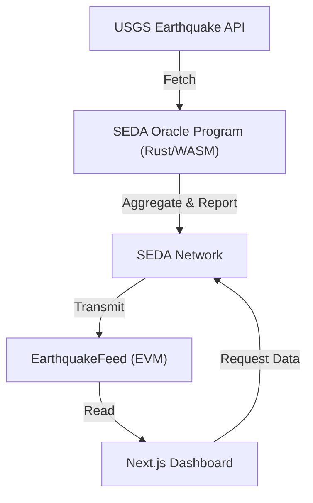

# Earthquake Oracle on SEDA

Fetch and report recent earthquake data (magnitude, location, time) from the USGS API to the SEDA Network, making it available on-chain and accessible to EVM smart contracts and a modern frontend dashboard.

---

## Project Overview
This project is a full-stack Oracle solution for the [SEDA Network](https://seda.xyz/):
- **Backend/Oracle Program:** Fetches earthquake data from the USGS API, aggregates it, and posts it to SEDA.
- **EVM Smart Contract:** Receives and stores earthquake data on-chain (Base Sepolia).
- **Frontend Dashboard:** Next.js app to view recent earthquakes and request new data.

---

## Features
- Fetches real-time earthquake data from [USGS API](https://earthquake.usgs.gov/fdsnws/event/1/)
- Aggregates and reports median magnitude, location, and time
- Oracle Program written in Rust, compiled to WASM for SEDA
- EVM contract (`EarthquakeFeed`) for on-chain storage and access
- Next.js/React frontend with ethers.js and wagmi for contract interaction
- End-to-end scripts for deployment, testing, and data requests

---

## Architecture


---

## 🛠️ Getting Started

### Prerequisites
- [Bun](https://bun.sh/) (for scripts and dev tools)
- [Rust](https://rustup.rs/) (for Oracle Program)
- [Node.js](https://nodejs.org/) (for frontend)
- [Hardhat](https://hardhat.org/) (for EVM contract)
- [Git](https://git-scm.com/)

### 1. Clone the Repo
```sh
git clone https://github.com/YOUR_USERNAME/YOUR_REPO_NAME.git
cd YOUR_REPO_NAME
```

### 2. Install Dependencies
- **Backend/Oracle:**
  ```sh
  bun install
  rustup target add wasm32-wasip1
  ```
- **EVM/Hardhat:**
  ```sh
  cd integrations/evm-hardhat
  bun install
  # or npm install
  ```
- **Frontend:**
  ```sh
  cd frontend
  npm install
  ```

---

## ⚙️ Configuration

Create a `.env` file in the root and in `frontend/` with the following:

**Root `.env`**
```
SEDA_RPC_ENDPOINT=https://rpc.devnet.seda.xyz
SEDA_MNEMONIC=your mnemonic here
ORACLE_PROGRAM_ID=your oracle program id here
```

**Frontend `.env.local`**
```
NEXT_PUBLIC_CONTRACT_ADDRESS=0xDEe97167Aa52feA42398Ac48b08b4dC0313DE9b5

NEXT_PUBLIC_ORACLE_PROGRAM_ID=0x0053b6c1d9b123f66f8100c6bf043fcd98745d5de6fcef17932f896837102cfd

# WalletConnect Configuration 

NEXT_PUBLIC_WALLETCONNECT_PROJECT_ID=7ec290a977afc4721a7e52807854bf73
```

---

## 🏗️ Building & Testing

### Backend/Oracle Program
- **Build:**
  ```sh
  bun run build
  ```
- **Test:**
  ```sh
  bun run test
  ```

### EVM/Hardhat
- **Compile & Test:**
  ```sh
  npx hardhat compile
  npx hardhat test
  ```
- **Deploy Contract:**
  ```sh
  npx hardhat run tasks/deploy.ts --network base_sepolia
  ```

### Frontend
- **Run Dev Server:**
  ```sh
  npm run dev
  ```
  Visit [http://localhost:3000](http://localhost:3000)

---

## 📡 Usage

### 1. Upload Oracle Program to SEDA
```sh
bun run deploy
```
- Requires `SEDA_RPC_ENDPOINT` and `SEDA_MNEMONIC` in `.env`.
- Note the `ORACLE_PROGRAM_ID` output.

### 2. Deploy EVM Contract
- Set your Oracle Program ID in the contract deployment script or `.env`.
- Deploy to Base Sepolia:
  ```sh
  npx hardhat run tasks/deploy.ts --network base_sepolia
  ```
- Note the deployed contract address.

### 3. Post a Data Request
```sh
bun run post-dr
```
- This will fetch and post the latest earthquake data to SEDA and the EVM contract.

### 4. View on Frontend
- Start the frontend and view the dashboard at [http://localhost:3000](http://localhost:3000)
- You can request new data and view the latest earthquakes on-chain.

---

## 🧪 Testing
- Backend: `bun run test`
- EVM: `npx hardhat test`
- Frontend: `npm run test` (if you add frontend tests)

---

## Links
- [SEDA Docs: Building an Oracle Program](https://docs.seda.xyz/home/for-developers/building-an-oracle-program)
- [SEDA SDK](https://github.com/sedaprotocol/seda-sdk)
- [USGS Earthquake API](https://earthquake.usgs.gov/fdsnws/event/1/)
- [SEDA Explorer](https://explorer.seda.xyz/)

---

## License
MIT License. See [LICENSE](LICENSE).